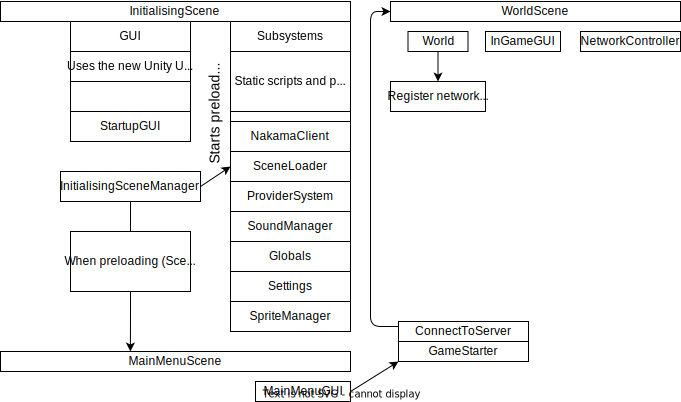
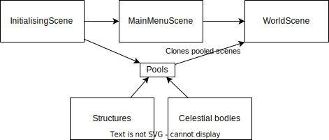
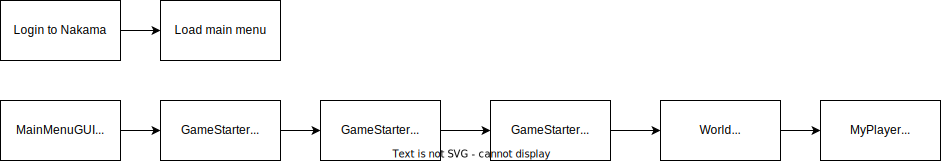

[The client](https://github.com/OpenHellion/Client) is the part of the project that most players interact with. It contains all of the graphical assets, handles rendering, and serves as an interface to the player.

As the diagram below shows, intialisation is handled by Initialising Scene. When this is completed, the player is sent over to the Main Menu Scene. This scene then sends the player to the Client scene.

NB: The diagram shows as the game should be, and therefore mignt not reflect the current state of the codebase.

The client scene starts by initialising all of the dependencies it needs to start a game. It then follows on by getting the match it wants from the NakamaManager, and then joins that match.

In addition to this, there are also many scenes for the various structures and celestial objects in the game. These are loaded and cached on initialisation and fetched when they are to be used in the game.

## Joining a server
Joining a server is a pretty straightforward process. It starts with logging in with Nakama, then fetching a server to join, which starts a class called GameStarter. Following this, the client connects to the server using a custom Tcp transport, which sends out an event when completed.

After this a bunch of data is exchanged to load the world and etc. The diagram below should bring some insight into the workings of the process.

