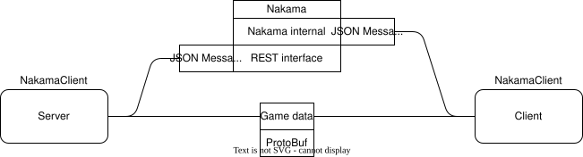
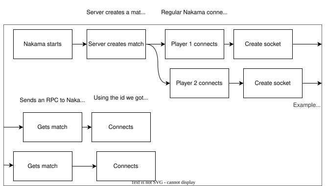

OpenHellion has two types of server, the *main server* and the *game server*.

The main server handles authenification of players and storing basic character information. Nakama is used as a platform for the main server, and Nakama and main server is used interchangably.

Game servers run a simulation of the world, which means they do most of the heavy lifting. These are what the player connect to when they hit play in the main menu.

The components that handles network connectivity are located in the `OpenHellion.Net` namespace on the client and the server. The `OpenHellion.Social` namespace handles communication with Nakama.

As an example of how connections between the client and server is handled, we have the communications example graph. It walks us from the immediate connection, done right when you open the game, to the server creating match to join and to us connecting to it.

