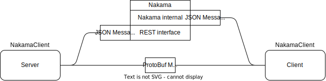

OpenHellion uses Nakama as a main server. The tasks the main server handles are: user accounts, friends, achievements (todo), match handling, chat (todo), character info, parties (todo), and notifications (todo).

The components that handles network connectivity are located in the `OpenHellion.Net` namespace on the client and the server. In addition, the client has another namespace called social, which handles communication with Nakama. The server communicates with Nakama through the `MainServerConnection` class, located in the Net namespace.

The most important task of the main server is to handle authenification of players and storing basic character information. The server handles the simulation of the world.

As an example of how connections between the client and server is handled, we have the communications example graph. It walks us from the immediate connection, done right when you open the game, to the server creating match to join and to us connecting to it.

