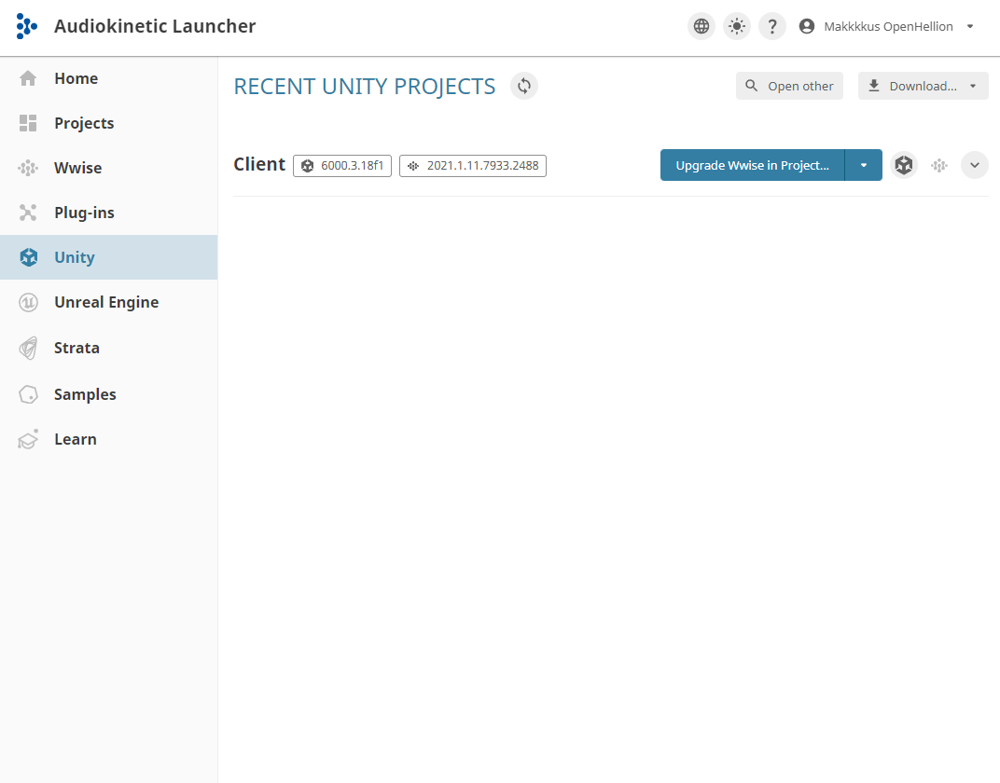
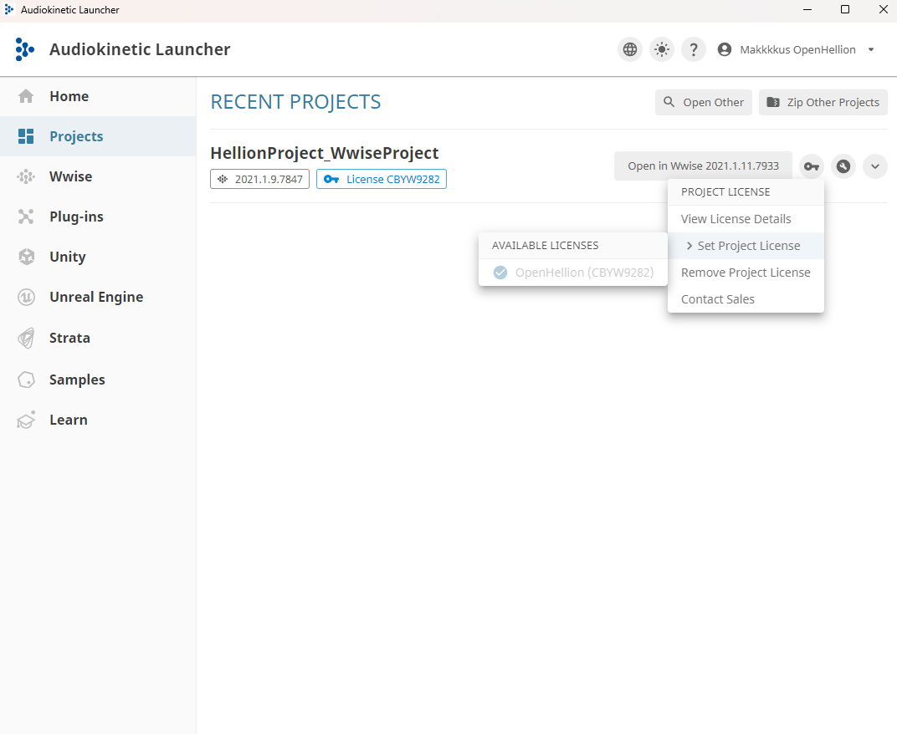
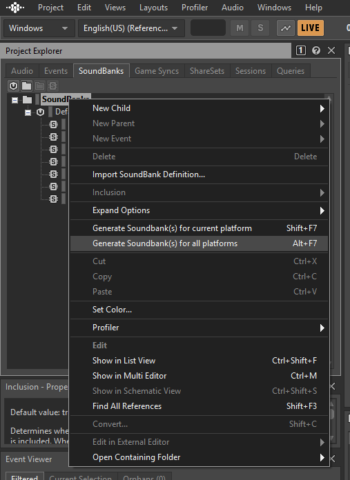

Since OpenHellion is still in early development, you cannot simply download the game and play it as is. You therefore have to compile it from source. This page will explain how to do so.

This guide is written for Windows. Compiling on Linux does not work because of Wwise. [This might be fixed in the future.](https://github.com/orgs/OpenHellion/projects/4/views/6)

## Minimum requirements
* 30 GB of disk space
* 6 GB of RAM
* 16 GB of RAM to build

Processor and graphics card shouldn't matter much, but it has to at least run Unity; Settings can be modified to increase performance.

## 1. Download source
Install [Git](https://git-scm.com/) or [GitHub Desktop](https://desktop.github.com/download/) to have a reliable way to download the source. This isn't neccecary, but highly recommended to do.

Download the source from [https://github.com/OpenHellion/Client](https://github.com/OpenHellion/Client) into a folder you choose.

Simplest is to use execute following command in the folder you with to install the client (needs [Git](https://git-scm.com/)).

```sh
git clone https://github.com/OpenHellion/Client
```

## 2. Setup Unity and Wwise
Download and install [Unity Hub](https://unity.com/) and the [Audiokinetic launcher](https://www.audiokinetic.com/en/wwise/overview/) from their official websites. Download the Unity version described on the [Client git repository](https://github.com/OpenHellion/Client) using Unity Hub. Do not use Unity Hub to open the Client first time as it does not download the correct files required for audio.

Create an Audiokinetic account and apply for a modding licence on [their website](https://www.audiokinetic.com/en/profile/school/6808/). This is free and you should get your licence within two working days.

Log in on the Audiokinetic launcher, and open the Unity tab. Locate the `Client` install you downloaded on the last step, and after some time it will appear in the list. Then download the Wwise SDK version required by the project in the `Wwise` tab. Open the Wwise project to test if the Wwise is installed.



After obtaining a lisence open the Audiokinetic launcher again and navigate to the `Projects` tab. After refreshing for some time, the project should pop up and you can set a licence.



Open the project in Wwise, set your platform in the dropdown in the upper-left corner. Afterwards, navigate to SoundBanks in the Project Explorer window, right click `SoundBanks`, and click on `Generate Soundbanks` for current platform.



Finally, open the Unity editor using the Audiokinetic launcher. This will take some time depending on the speed of your computer because this step imports all files and builds the project, something that will increase the size of you project dramatically.

## 3. Setting up server (works on linux)
Download the [latest version of dotnet 8](https://dotnet.microsoft.com/en-us/download/dotnet/8.0) and install it.

Download the game server from [https://github.com/OpenHellion/Server/](https://github.com/OpenHellion/Server/) using Git.

Run the server using `dotnet run` in the server folder. Dependencies should be installed by itself, which will cause the first compile to be slow.

### Set up main server (optional)
OpenHellion also supports cases where you may want to host multiple servers at once or want strong authentification. **This is only relevant for those who want to set up public servers.**

Make sure [Node.js](https://nodejs.org/en), [Docker](https://www.docker.com/), and [Docker Compose](https://docs.docker.com/compose/install) are installed.

Download the main server from [https://github.com/OpenHellion/Nakama](https://github.com/OpenHellion/Nakama).

Open the folder and edit `http_key` to a long secret key of your liking. This will be the key that lets servers register with your main server. **Make sure it is not leaked, and change often**.

Run the main server using `node run serve` in the folder you downloaded.

For server owners, open `GameServer.ini`, remove the `offline_mode` setting, and set your `http_key`.

For players, they neeed to remove `offline_mode` from `Preferences.ini`, and configure `main_server_ip` and optionally `main_server_port` to where you are hosting your main server.

You may optionally also set `main_server_key` if you want extra security (this requires setting `socket.server_key` in the main server config).

## 4. Troubleshooting
If these steps were followed correctly, OpenHellion should compile fine.

### Wwise is placed at a path that has a space in it
Simply reinstall Wwise in a directory that has no spaces in its path.

Please take contact on the Discord if you have issues: [https://discord.gg/9nGWgQ8Uyf](https://discord.gg/9nGWgQ8Uyf)
